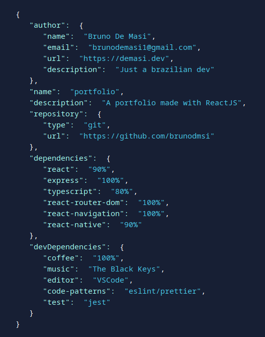

# Prettify JSON

> Minimalist package which makes possible for you to display your JSON as a element on your React App, personalizing the colors.

[](https://www.npmjs.com/package/react-prettify-json) [](https://github.com/airbnb/javascript)

## Install

```bash
npm install --save react-prettify-json
```

## Usage

```tsx
import React from 'react';

import PrettyJSON from 'react-prettify-json';

const Example: React.FC = () =>  {
  const jsonObject = {
    "react": ">=16.0.0",
    "@unform/core": ">=5.0.0"
  }

  return (
    <PrettyJSON 
      jsonObject={jsonObject}
    />
  )
}
```
You can use that above and you're done. But, if you want a little more customization, you can set your own colors
```tsx
  <PrettyJSON 
    jsonObject={jsonObject}
    colors={{
      punctuation: '#fff',
      key: '#a3fff3',
      value: '#49cabe',
      string: '#49caeb',
    }}
  />
```
And achieve a result like this (photo took directly from my [portfolio](https://demasi.dev))    
    



## API
### Props
If a prop is **Required**, the `default` field will appear empty.
name | type | description | default 
--- | --- | --- | ---
jsonObject | json object (pls) | The json object that you want styled | --
colors | object: punctuation, key, value, string | Each color variable corresponds to each one of JSON data types | everything **black**


## License

MIT © [Bruno De Masi](https://github.com/brunodmsi)
